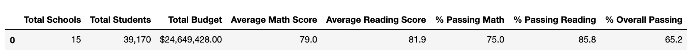
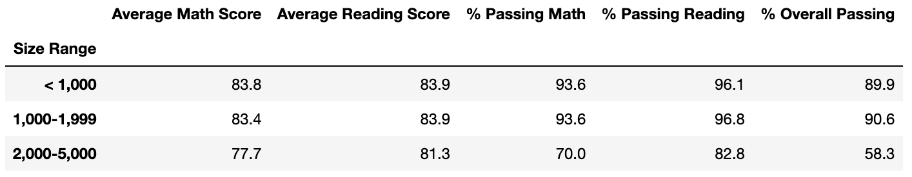
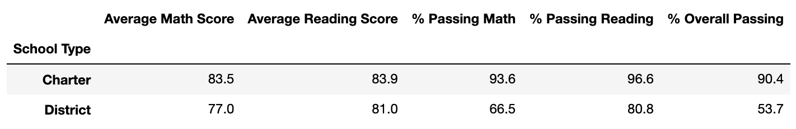

# School and District Academic Performance Analysis

## Overview
The purpose of this analysis is to evaluate academic performance of the schools in the district and of the district as a whole. In each analysis, the average math score, average reading score, percent of students passing math, percent of students passing reading, and the overall passing rates are the key metrics. The schools are evaluated by their spending and size, with breakdowns of performances by grade. The district as a whole is evaluated in one summary, as well as by the type of school: charter versus district.

Given the discrepancy of the math and reading scores found in Thomas High School's 9th grade, this report focuses on changes, if any in the analysis after replacing these scores with NaNs. This revised analysis is performed in the file PyCitySchools_Challenge.ipynb, and the original analysis is performed in the file PyCitySchools_Original.ipynb. 

The two sets of raw data provided are:
1. The first data set contains each school's name, type, size, and budget.
2. The second data set contains each student's name, gender, grade, school name, reading score, and math score. 

Percentage data is usually presented by rounding to the nearest hundreths. However, for comparison purposes, one more decimal place has been added to evaluate the effect of the revised data set. 

## Results
For each of the key analysis tables, the original and revised results (where Thomas High School math and reading scores are replaced with NaNs) are presented below for comparison:

### District Summary
- The district summary for the original analysis is as follows:

- The adjusted district summary is:

- Almost every metric is slightly lower in the adjusted summary. Only the Average Reading Score is the same between the two tables. 

### School Summary
- The school summary for the original analysis is:

- The adjusted school summary is:

### Thomas High School’s performance relative to the other schools
- Sorting by the % Overall Passing, Thomas High School remains number two in school rankings. 

### Math scores by grade
- Without any adjustments, the math scores by grade are:

- After the adjustments, the math scores by grade are the same, except Thomas High School's 9th grade scores are replaced by NaN

### Reading scores by grade
- Without any adjustments, the reading scores by grade are:

- After the adjustments, the reading scores by grade are the same, except Thomas High School's 9th grade scores are replaced by NaN

### Scores by school spending
- The original scores by school spending are:

- The revised scores by school spending are:

- The average spending per student at Thomas High School is $638, falling into the $630-$644 Spending Range Per Student. Comparing only this line of data in both tables, 

### Scores by school size
- The original scores by school size are:

- The revised scores by school size are:

- Thomas High School has 1,635 students, falling into the 1,000-1,999 Size Range. Comparing only this line of data in both tables, % Passing Reading is slightly lower for the revised data set. 

### Scores by school type
- The original scores by school type are:

- The revised scores by school type are:

- Thomas High School is a Charter school, so comparing the Charter school type results from Original and Revised, no changes are noted that are significant to the thousandth digit. 

## Summary:

The four changes in the updated school district analysis after reading and math scores for the ninth grade at Thomas High School have been replaced with NaNs:
1. District performance is slightly lower across the key metrics, except for the average reading score, which remained the same.
2. % Passing Reading for the $630-$644 Spending Range Per Student is lower by 0.1% in the revised analysis. 
3. No 9th grade data is available for either reading or math scores for Thomas High School
4. 

Although no changes are noted in some of the analysis compared, it only reflects a insignificant change to the nearest thousandth for percentages and to the nearest tenths for average scores. If further compromises of scores integrity is discovered, the analysis can change, which will alter decisions made using these numbers. Given these changes in academic performance results, it's recommended to further investigate the math and reading scores discrepancies at Thomas High School. 